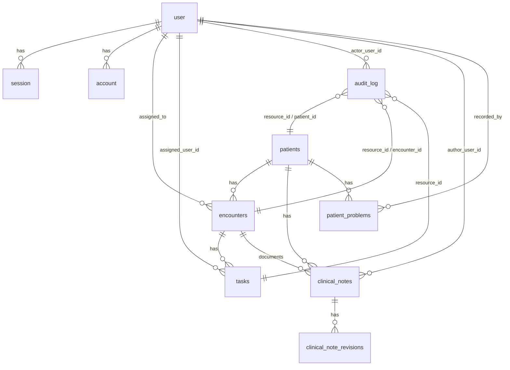

# Schema Blueprint — Patient Flow

> **Source of truth for database schema.** All Drizzle ORM definitions must conform to this blueprint.
>
> **How to use:** Attach `#schema.md` to Copilot chat when modifying `apps/api/src/core/db/schema.ts` or generating migrations.
>
> **Drift check:** Run `/check-contract-drift` to compare this blueprint against `schema.ts`.

**Database:** PostgreSQL 18 · **ORM:** Drizzle
**Schema file:** `apps/api/src/core/db/schema.ts` (single file — never split)
**Migration workflow:** schema change → `pnpm run db:generate` → review SQL → `pnpm run db:migrate`

---

## Conventions

| Convention | Rule |
|-----------|------|
| Business entity IDs | `uuid("id").primaryKey().default(sql\`uuidv7()\`)` — never `gen_random_uuid()` |
| Auth table IDs | `text("id").primaryKey()` — Better Auth convention |
| Table naming | `snake_case`, plural (e.g., `patients`, `encounters`) |
| Column naming | `snake_case` (e.g., `first_name`, `created_at`) |
| Timestamps | `timestamp('created_at').defaultNow().notNull()` + `timestamp('updated_at').defaultNow().notNull()` |
| Enums | `text` columns with inline comment listing valid values — never PG enum types |
| Flexible data | `jsonb` columns (e.g., `audit_log.diff`) |
| Foreign keys | `.references(() => table.id, { onDelete: 'cascade' | 'set null' })` |
| Indexes | Named `<table>_<column>_idx`, defined in table's second argument |

---

## Auth Tables (Better Auth Managed)

> These tables are managed by Better Auth. Do not modify their structure — only add columns to `user` for app-specific fields.

### `user`

| Column | Type | Constraints | Notes |
|--------|------|-------------|-------|
| `id` | `text` | PK | Better Auth text ID |
| `name` | `text` | nullable | Display name |
| `email` | `text` | NOT NULL, UNIQUE | |
| `emailVerified` | `boolean` | default `false` | |
| `image` | `text` | nullable | Avatar URL |
| `role` | `text` | NOT NULL, default `'pending'` | `pending` \| `admin` \| `provider` \| `clinical_staff` \| `front_desk`. Server-owned (not client-writable). Defaults to `pending` so any creation path that does not set a role explicitly — notably a self-service Google signup — fails closed |
| `title` | `text` | nullable | Professional designation |
| `status` | `text` | NOT NULL, default `'active'` | `active` \| `suspended`. Server-owned. The only suspend mechanism |
| `banned` | `boolean` | default `false` | Added by the Better Auth admin plugin. Unused by app code |
| `banReason` | `text` | nullable | Added by the Better Auth admin plugin. Unused by app code |
| `banExpires` | `timestamp` | nullable | Added by the Better Auth admin plugin. Unused by app code |
| `createdAt` | `timestamp` | NOT NULL, default now | |
| `updatedAt` | `timestamp` | NOT NULL, default now | |

### `session`

| Column | Type | Constraints |
|--------|------|-------------|
| `id` | `text` | PK |
| `expiresAt` | `timestamp` | NOT NULL |
| `token` | `text` | NOT NULL, UNIQUE |
| `ipAddress` | `text` | nullable |
| `userAgent` | `text` | nullable |
| `userId` | `text` | NOT NULL, FK → `user.id` (cascade) |
| `impersonatedBy` | `text` | nullable | Added by the Better Auth admin plugin. Unused by app code |
| `createdAt` | `timestamp` | NOT NULL, default now |
| `updatedAt` | `timestamp` | NOT NULL, default now |

### `account`

| Column | Type | Constraints |
|--------|------|-------------|
| `id` | `text` | PK |
| `accountId` | `text` | NOT NULL |
| `providerId` | `text` | NOT NULL |
| `userId` | `text` | NOT NULL, FK → `user.id` (cascade) |
| `accessToken` | `text` | nullable |
| `refreshToken` | `text` | nullable |
| `idToken` | `text` | nullable |
| `accessTokenExpiresAt` | `timestamp` | nullable |
| `refreshTokenExpiresAt` | `timestamp` | nullable |
| `scope` | `text` | nullable |
| `password` | `text` | nullable |
| `createdAt` | `timestamp` | NOT NULL, default now |
| `updatedAt` | `timestamp` | NOT NULL, default now |

### `verification`

| Column | Type | Constraints |
|--------|------|-------------|
| `id` | `text` | PK |
| `identifier` | `text` | NOT NULL |
| `value` | `text` | NOT NULL |
| `expiresAt` | `timestamp` | NOT NULL |
| `createdAt` | `timestamp` | NOT NULL, default now |
| `updatedAt` | `timestamp` | NOT NULL, default now |

---

## Business Tables

### `patients`

| Column | Type | Constraints | Notes |
|--------|------|-------------|-------|
| `id` | `uuid` | PK, default `uuidv7()` | |
| `first_name` | `text` | NOT NULL | |
| `last_name` | `text` | NOT NULL | |
| `date_of_birth` | `timestamp` | nullable | |
| `phone` | `text` | nullable | Single phone number |
| `email` | `text` | nullable | |
| `address` | `jsonb` | nullable | `{ street, postal_code, city, country }` — `country` is ISO 3166-1 alpha-2 |
| `identity` | `jsonb` | nullable | `{ document_type, country_national, scanned_document }` — `country_national` is ISO 3166-1 alpha-2 |
| `financials` | `jsonb` | nullable | `{ health_insurance, reimbursement, currency }` — `currency` is ISO 4217 |
| `emergency_contact` | `jsonb` | nullable | `{ name, relation, phone, email, comments }` — `relation` is a slug from the standard list (see below) |
| `medical_history` | `text` | nullable | Clinical history |
| `medical_history_date` | `timestamp` | nullable | When history was last recorded |
| `physicians` | `jsonb` | nullable | `{ attending, correspondent, other }` |
| `transport_logistics` | `jsonb` | nullable | `{ modes: string[], comments }` — `modes` is a subset of `public_transport`, `taxi`, `ambulance` |
| `notes` | `text` | nullable | General non-clinical notes |
| `created_at` | `timestamp` | NOT NULL, default now | |
| `updated_at` | `timestamp` | NOT NULL, default now | |

**Indexes:**
| Name | Columns |
|------|---------|
| `patients_name_idx` | `last_name`, `first_name` |
| `patients_email_idx` | `email` |

**jsonb Shapes:**
```json
{
  "address": { "street": "text", "postal_code": "text", "city": "text", "country": "ISO 3166-1 alpha-2 (e.g. FR, US)" },
  "identity": { "document_type": "text", "country_national": "ISO 3166-1 alpha-2 (e.g. FR, US)", "scanned_document": "boolean" },
  "financials": { "health_insurance": "text", "reimbursement": "text", "currency": "ISO 4217 (e.g. EUR, USD)" },
  "emergency_contact": { "name": "text", "relation": "relation slug", "phone": "text", "email": "text", "comments": "text" },
  "physicians": { "attending": "text", "correspondent": "text", "other": "text" },
  "transport_logistics": { "modes": ["public_transport", "taxi", "ambulance"], "comments": "text" }
}
```

**Standard lists (client-rendered, server accepts any string):**

| Field | Allowed values |
|-------|----------------|
| `emergency_contact.relation` | `partner`, `parent`, `child`, `sibling`, `grandparent`, `other_relative`, `friend_neighbour`, `carer`, `other` |
| `transport_logistics.modes[]` | `public_transport`, `taxi`, `ambulance` |

> **Note:** `relation` is constrained in the UI only — the API accepts any string, so
> records written before the dropdown existed still round-trip. `modes` **is** validated
> server-side against the list above (unknown values are rejected with `400`).

> **ISO Code Validation:** `address.country`, `identity.country_national` are validated against ISO 3166-1 alpha-2 codes. `financials.currency` is validated against ISO 4217 codes. Validation is enforced at the DTO level via `@IsIn()`. Display names are resolved on the frontend using `Intl.DisplayNames`.

**Role-Based Read Visibility:**

| Section | admin | provider | clinical_staff | front_desk |
|---------|:-----:|:-------:|:--------------:|:----------:|
| identity | ✓ | ✓ | ✓ | ✓ |
| contact (address, phone, email) | ✓ | ✓ | ✓ | ✓ |
| financials | ✓ | ✓ | ✗ | ✓ |
| emergency_contact | ✓ | ✓ | ✓ | ✓ |
| medical (medical_history, medical_history_date, physicians) | ✓ | ✓ | ✓ | ✗ |
| transport_logistics | ✓ | ✓ | ✓ | ✓ |
| notes | ✓ | ✓ | ✓ | ✗ |

**Role-Based Write Visibility:**

| Section | admin | provider | clinical_staff | front_desk |
|---------|:-----:|:-------:|:--------------:|:----------:|
| identity | ✓ | ✗ | ✗ | ✓ |
| contact | ✓ | ✗ | ✓ | ✓ |
| financials | ✓ | ✗ | ✗ | ✓ |
| emergency_contact | ✓ | ✓ | ✓ | ✓ |
| medical | ✓ | ✓ | ✓ | ✗ |
| transport_logistics | ✓ | ✗ | ✓ | ✓ |
| notes | ✓ | ✓ | ✓ | ✗ |

> Core identity fields (`id`, `first_name`, `last_name`, `date_of_birth`, `email`, `phone`, `created_at`, `updated_at`) are always visible to all authenticated roles. Server-side filtering strips disallowed sections before returning the response.

---

### `encounters`

| Column | Type | Constraints | Notes |
|--------|------|-------------|-------|
| `id` | `uuid` | PK, default `uuidv7()` | |
| `patient_id` | `uuid` | NOT NULL, FK → `patients.id` (cascade) | |
| `status` | `text` | NOT NULL | `scheduled` \| `checked_in` \| `in_progress` \| `completed` \| `cancelled` |
| `assigned_to` | `text` | nullable, FK → `user.id` (set null) | Ownership lock |
| `scheduled_time` | `timestamp` | nullable | |
| `notes` | `text` | nullable | |
| `version` | `integer` | NOT NULL, default `0` | Optimistic lock |
| `created_at` | `timestamp` | NOT NULL, default now | |
| `updated_at` | `timestamp` | NOT NULL, default now | |

**Indexes:**
| Name | Columns |
|------|---------|
| `encounters_patient_idx` | `patient_id` |
| `encounters_status_idx` | `status` |
| `encounters_assigned_to_idx` | `assigned_to` |
| `encounters_scheduled_time_idx` | `scheduled_time` |

**FSM Transition Map:**
```
scheduled   → [checked_in, cancelled]
checked_in  → [in_progress, cancelled]
in_progress → [completed, cancelled]
completed   → [] (terminal)
cancelled   → [] (terminal)
```

---

### `tasks`

| Column | Type | Constraints | Notes |
|--------|------|-------------|-------|
| `id` | `uuid` | PK, default `uuidv7()` | |
| `encounter_id` | `uuid` | NOT NULL, FK → `encounters.id` (cascade) | |
| `title` | `text` | NOT NULL | |
| `description` | `text` | nullable | |
| `status` | `text` | NOT NULL | `todo` \| `in_progress` \| `done` |
| `priority` | `text` | NOT NULL | `low` \| `medium` \| `high` |
| `assigned_user_id` | `text` | nullable, FK → `user.id` (set null) | |
| `assigned_role` | `text` | nullable | |
| `blocking` | `boolean` | NOT NULL, default `false` | |
| `due_at` | `timestamp` | nullable | |
| `created_at` | `timestamp` | NOT NULL, default now | |
| `updated_at` | `timestamp` | NOT NULL, default now | |

**Indexes:**
| Name | Columns |
|------|---------|
| `tasks_encounter_idx` | `encounter_id` |
| `tasks_status_idx` | `status` |
| `tasks_assigned_user_idx` | `assigned_user_id` |
| `tasks_priority_idx` | `priority` |

---

### `audit_log`

> **Append-only.** Never update or delete rows. No `updated_at` column.

| Column | Type | Constraints | Notes |
|--------|------|-------------|-------|
| `id` | `uuid` | PK, default `uuidv7()` | |
| `actor_user_id` | `text` | nullable, FK → `user.id` (**set null**) | Nullable so deleting a staff account preserves its audit history |
| `actor_name` | `text` | nullable | Snapshot of the actor's name at write time; survives rename and deletion |
| `actor_role` | `text` | NOT NULL | Role held at the time of the action |
| `action` | `text` | NOT NULL | Format: `entity.verb` (e.g., `patient.created`) |
| `resource_type` | `text` | NOT NULL | The entity type the action *targeted*: `patient`, `encounter`, `task`, `user`, `clinical_note`, `problem` |
| `resource_id` | `text` | NOT NULL | Polymorphic. `uuidv7` for business entities, Better Auth text id for `user` |
| `patient_id` | `uuid` | nullable, **no FK** | Denormalized scope: the patient this event concerns |
| `encounter_id` | `uuid` | nullable, **no FK** | Denormalized scope: the encounter this event concerns |
| `diff` | `jsonb` | nullable | `{ field: { from, to } }` |
| `ip_address` | `text` | nullable | |
| `created_at` | `timestamp` | NOT NULL, default now | |

**Why the scope columns exist:** `resource_type`/`resource_id` record only the
entity an action *targeted*. An encounter created for a patient is therefore
`resource_type='encounter'`, which a query for a patient's history cannot match —
the row has no link back to the patient. `patient_id` and `encounter_id` add that
link so one query returns a patient's complete record: the patient itself, every
encounter, and every task on those encounters.

**Deliberately no foreign keys** on `patient_id`/`encounter_id`. Audit rows must
outlive the entities they describe; an FK with `cascade` would erase history at
exactly the moment it matters most (a deleted encounter), and `set null` would
silently lose the scope. Same principle as `resource_id` (ADR 0018).

**Scope rules** — what each event populates:

| Action | `resource_id` | `patient_id` | `encounter_id` |
|---|---|---|---|
| `patient.*` | patient id | patient id | — |
| `encounter.*` | encounter id | the encounter's patient | encounter id |
| `task.*` | task id | the encounter's patient | the task's encounter |
| `clinical_note.*` | note id | the note's patient | the note's encounter |
| `problem.*` | problem id | the problem's patient | the problem's encounter (may be null) |
| `user.*`, `admin.*` | user id | — | — |

**Clinical entries are metadata-only.** `clinical_note.*` and `problem.*` diffs
never contain note text, diagnosis wording or any other clinical content:

| Action | Diff |
|---|---|
| `clinical_note.created` | `{ note_type: { from: null, to: ... } }` |
| `clinical_note.updated` | `{ version: { from: N, to: N + 1 } }` — **nothing else** |
| `clinical_note.deleted` | `{ note_type, version }` |
| `problem.created` | `{ code, status }` |
| `problem.updated` | `{ status, code }` |
| `problem.deleted` | `{ code, status }` |

> **Why:** `GET /api/audit/encounter/:id` is open to every authenticated role
> (unlike the patient audit route, which ADR 0020 restricted to clinical roles).
> Clinical text in a diff would therefore be readable by `front_desk`. Keeping
> diffs content-free means the encounter timeline can stay open without leaking
> PHI. The content trail is `clinical_note_revisions`, which is access-controlled.
>
> Locked by a unit test asserting the update diff contains no content keys.

**Indexes:**
| Name | Columns |
|------|---------|
| `audit_log_actor_idx` | `actor_user_id` |
| `audit_log_resource_idx` | `resource_type`, `resource_id` |
| `audit_log_action_idx` | `action` |
| `audit_log_created_at_idx` | `created_at` |
| `audit_log_patient_idx` | `patient_id`, `created_at` |
| `audit_log_encounter_idx` | `encounter_id`, `created_at` |

---

### `clinical_notes`

> The SOAP documentation of a visit. This is the **head** row holding current
> content; superseded versions live in `clinical_note_revisions`.

| Column | Type | Constraints | Notes |
|--------|------|-------------|-------|
| `id` | `uuid` | PK, default `uuidv7()` | |
| `patient_id` | `uuid` | NOT NULL, FK → `patients.id` (cascade) | Denormalized from the encounter so a patient's notes need no join |
| `encounter_id` | `uuid` | NOT NULL, FK → `encounters.id` (cascade) | A note documents a visit |
| `note_type` | `text` | NOT NULL, default `'consultation'` | `consultation` \| `nursing` \| `procedure` \| `other` |
| `subjective` | `text` | nullable | SOAP: patient-reported history |
| `objective` | `text` | nullable | SOAP: examination findings, vitals |
| `assessment` | `text` | nullable | SOAP: clinical impression — where the diagnosis narrative goes |
| `plan` | `text` | nullable | SOAP: treatment plan |
| `additional_notes` | `text` | nullable | Escape hatch for content outside SOAP |
| `author_user_id` | `text` | nullable, FK → `user.id` (**set null**) | Nullable so deleting a staff account preserves the note |
| `author_name` | `text` | nullable | Snapshot at write time; survives rename and deletion |
| `author_role` | `text` | NOT NULL | Snapshot — "who was this as?" is clinically meaningful |
| `version` | `integer` | NOT NULL, default `1` | Optimistic lock **and** revision counter |
| `created_at` | `timestamp` | NOT NULL, default now | |
| `updated_at` | `timestamp` | NOT NULL, default now | |

**Indexes:**
| Name | Columns |
|------|---------|
| `clinical_notes_patient_idx` | `patient_id`, `created_at` |
| `clinical_notes_encounter_idx` | `encounter_id`, `created_at` |

**Why every SOAP field is optional:** a note can be saved partially and completed
later. The value of the structure is not enforcement — it is that `assessment`
and `plan` are individually addressable, which is what lets a diagnosis narrative
and a treatment plan have a defined home instead of living in one paragraph.

---

### `clinical_note_revisions`

> **Append-only.** Never update or delete rows. No `updated_at` column.

| Column | Type | Constraints | Notes |
|--------|------|-------------|-------|
| `id` | `uuid` | PK, default `uuidv7()` | |
| `note_id` | `uuid` | NOT NULL, FK → `clinical_notes.id` (cascade) | |
| `revision_number` | `integer` | NOT NULL | The head's `version` at the time this was superseded |
| `note_type` | `text` | NOT NULL | |
| `subjective` | `text` | nullable | |
| `objective` | `text` | nullable | |
| `assessment` | `text` | nullable | |
| `plan` | `text` | nullable | |
| `additional_notes` | `text` | nullable | |
| `edited_by` | `text` | nullable, FK → `user.id` (**set null**) | Who made the edit that superseded this content |
| `edited_by_name` | `text` | nullable | Snapshot at write time |
| `created_at` | `timestamp` | NOT NULL, default now | |

**Indexes:**
| Name | Columns |
|------|---------|
| `clinical_note_revisions_note_idx` | `note_id`, `revision_number` |

**Revision mechanics:** on `PUT /api/clinical-notes/:id` the service, inside a
transaction, copies the **current head** into this table with
`revision_number = head.version`, then updates the head with
`WHERE id = ? AND version = ?` and `version = version + 1`.

So revision 1 is the original content, and revision N is the Nth superseded
version. This is the head-plus-history pattern: the head is the only row that is
ever written twice, and no authored content is destroyed.

> **This table is the content trail, which is why `audit_log` never holds
> clinical text** (see the audit scope rules below). Duplicating note content
> into audit diffs would leak it onto the encounter timeline, which every role
> can read.

---

### `patient_problems`

> The longitudinal problem list — diagnoses that persist across visits.

| Column | Type | Constraints | Notes |
|--------|------|-------------|-------|
| `id` | `uuid` | PK, default `uuidv7()` | |
| `patient_id` | `uuid` | NOT NULL, FK → `patients.id` (cascade) | |
| `encounter_id` | `uuid` | nullable, FK → `encounters.id` (**set null**) | Where it was first raised. `set null` so deleting a visit does not erase the diagnosis |
| `description` | `text` | NOT NULL | Always free text. Prefilled from the catalogue name on pick, but editable |
| `code` | `text` | nullable | ICD-10 code (e.g. `B54`). Null for off-list entries |
| `code_system` | `text` | nullable | `'ICD-10'` when `code` is set |
| `diagnosis_slug` | `text` | nullable | Catalogue slug. No FK — the catalogue is static code, not a table |
| `status` | `text` | NOT NULL, default `'active'` | `active` \| `resolved` \| `inactive` |
| `onset_date` | `timestamp` | nullable | |
| `resolved_date` | `timestamp` | nullable | |
| `recorded_by` | `text` | nullable, FK → `user.id` (**set null**) | |
| `recorded_by_name` | `text` | nullable | Snapshot at write time |
| `notes` | `text` | nullable | |
| `created_at` | `timestamp` | NOT NULL, default now | |
| `updated_at` | `timestamp` | NOT NULL, default now | |

**Indexes:**
| Name | Columns |
|------|---------|
| `patient_problems_patient_idx` | `patient_id`, `status` |

**Why `diagnosis_slug` is stored rather than derived from `code`:** it records
*that the clinician picked from the catalogue*, which is distinguishable from
free text that happens to read the same. It is also the key a future translation
lookup would use, so storing it now avoids a data migration later.

**Coding rules:**
- `description` is **never** constrained server-side.
- If `code` is supplied it must match an entry in the diagnosis catalogue, and
  `code_system` / `diagnosis_slug` must agree with it. Rejected with `400`
  otherwise.
- A problem with no `code` at all is valid — the catalogue is a 30-item
  shortlist, not a complete coding system.

> This mirrors how `transport_logistics.modes` is server-validated against a
> fixed list while `emergency_contact.relation` is UI-only.

---

## Clinical Documentation Visibility

Applies to `clinical_notes`, `clinical_note_revisions` and `patient_problems`.
These are the most sensitive records in the system, so access is narrower than
for the patient record itself.

| Capability | admin | provider | clinical_staff | front_desk | pending |
|------------|:-----:|:--------:|:--------------:|:----------:|:-------:|
| Read notes / problems | ✓ | ✓ | ✓ | ✗ | ✗ |
| Create note | ✓ | ✓ | ✓ | ✗ | ✗ |
| Create problem | ✓ | ✓ | ✓ | ✗ | ✗ |
| Edit a note | ✓ | ✓ (author only) | ✓ (author only) | ✗ | ✗ |
| Edit a problem | ✓ | ✓ | ✓ | ✗ | ✗ |
| Delete note / problem | ✓ | ✗ | ✗ | ✗ | ✗ |

**Edit authority on notes:** the note's author, or `admin`. A clinician who
disagrees with a colleague's note writes their own note rather than editing it —
the revision table preserves history, but authorship attribution is the stronger
guarantee.

**Enforcement:** `@Roles('admin', 'provider', 'clinical_staff')` + `RolesGuard`
on the controllers, plus CASL subjects `ClinicalNote` and `Problem` in
`core/auth/ability.ts`. The author check is enforced in the service, since it
depends on the row rather than the role.

> This matches the existing patient `medical` section rule (ADR 0004), so there
> is one clinical-visibility concept rather than two.

---

## Entity Relationships



> The audit relationships are **logical, not enforced**: `audit_log` holds no
> foreign keys to the business tables, so an audit row survives the deletion of
> the entity it describes. `patient_id` / `encounter_id` are plain columns.

---

## Adding a New Table — Checklist

When adding a new business table, ensure:

1. [ ] Table name is `snake_case`, plural
2. [ ] `id` column uses `uuid("id").primaryKey().default(sql\`uuidv7()\`)`
3. [ ] `created_at` and `updated_at` timestamps with `.defaultNow().notNull()`
4. [ ] Foreign keys use `.references()` with explicit `onDelete` policy
5. [ ] Indexes defined in table's second argument, named `<table>_<column>_idx`
6. [ ] Enum values stored as `text` with inline comment listing valid values
7. [ ] Schema blueprint (`docs/contracts/schema.md`) updated
8. [ ] API spec (`docs/contracts/api_spec.md`) updated if table has endpoints
9. [ ] `pnpm run db:generate` run and SQL reviewed
10. [ ] `pnpm run db:migrate` run to apply
